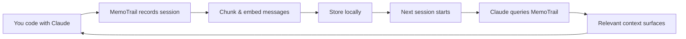

<div align="center">

# MemoTrail

**Your AI coding assistant forgets everything. MemoTrail fixes that.**

[](https://pypi.org/project/memotrail/)
[](https://www.python.org/downloads/)
[](LICENSE)
[](https://github.com/HalilHopa-Datatent/memotrail)

A persistent memory layer for AI coding assistants.
Every session recorded, every decision searchable, every context remembered.

[Quick Start](#quick-start) · [How It Works](#how-it-works) · [Available Tools](#available-tools) · [Roadmap](#roadmap)

</div>

---

## The Problem

Every new Claude Code session starts from zero. Your AI doesn't remember yesterday's 3-hour debugging session, the architectural decisions you made last week, or the approaches that already failed.

**Without MemoTrail:**
```
You: "Let's use Redis for caching"
AI:  "Sure, let's set up Redis"
         ... 2 weeks later, new session ...
You: "Why are we using Redis?"
AI:  "I don't have context on that decision"
```

**With MemoTrail:**
```
You: "Why are we using Redis?"
AI:  "Based on session from Jan 15 — you evaluated Redis vs Memcached.
      Redis was chosen for its data structure support and persistence.
      The discussion is in session #42."
```

## Quick Start

```bash
# 1. Install
pip install memotrail

# 2. Index your existing Claude Code history
memotrail index

# 3. Connect to Claude Code
claude mcp add memotrail -- memotrail serve
```

Done. Start a new session and ask: *"What did we work on last week?"*

<div align="center">

</div>

## How It Works



```
Claude Code session  →  Capture & chunk  →  Embed (all-MiniLM-L6-v2)
                                                    ↓
Next session         ←  Return context   ←  Semantic search (ChromaDB)
```

All processing happens locally. No cloud, no API keys, no data leaves your machine.

## Available Tools

Once connected, Claude Code gets these MCP tools:

| Tool | Description |
|------|-------------|
| `search_chats` | Semantic search across all past conversations |
| `get_decisions` | Retrieve recorded architectural decisions |
| `get_recent_sessions` | List recent coding sessions with summaries |
| `get_session_detail` | Deep dive into a specific session's content |
| `save_memory` | Manually save important facts or decisions |
| `memory_stats` | View indexing statistics and storage usage |

## CLI Commands

```bash
memotrail index                          # Index existing Claude Code history
memotrail search "redis caching decision"  # Search from terminal
memotrail stats                          # View indexing stats
memotrail serve                          # Start MCP server
```

## Architecture

```
~/.memotrail/
├── chroma/          # Vector embeddings (ChromaDB)
└── memotrail.db     # Session metadata (SQLite)
```

| Component | Technology | Details |
|-----------|-----------|---------|
| Embeddings | `all-MiniLM-L6-v2` | ~80MB, runs on CPU |
| Vector DB | ChromaDB | Persistent, local storage |
| Metadata | SQLite | Single-file database |
| Protocol | MCP | Model Context Protocol |

## Why MemoTrail?

| | MemoTrail | CLAUDE.md / Rules files | Manual notes |
|---|---|---|---|
| Automatic | Yes — records everything | No — you write it | No |
| Searchable | Semantic search | Ctrl+F only | Ctrl+F only |
| Scales | Thousands of sessions | Single file | Scattered files |
| Context-aware | Returns relevant context | Static rules | Manual lookup |
| Setup | 5 minutes | Always maintained | Always maintained |

MemoTrail doesn't replace `CLAUDE.md` — it complements it. Rules files are for instructions. MemoTrail is for memory.

## Roadmap

- [x] Claude Code session indexing
- [x] Semantic search across conversations
- [x] MCP server with 6 tools
- [x] CLI for indexing and searching
- [ ] Automatic decision extraction
- [ ] Session summarization
- [ ] Cursor collector
- [ ] Copilot collector
- [ ] VS Code extension
- [ ] Cloud sync (Pro)
- [ ] Team memory (Team)

## Development

```bash
git clone https://github.com/HalilHopa-Datatent/memotrail.git
cd memotrail
pip install -e ".[dev]"
pytest
ruff check src/
```

## Contributing

Contributions welcome! See [CONTRIBUTING.md](docs/CONTRIBUTING.md) for guidelines.

**Good first issues:**
- [ ] Add Cursor session collector
- [ ] Add Copilot session collector
- [ ] Improve chunking strategy
- [ ] Add BM25 keyword search alongside semantic search

## License

MIT — see [LICENSE](LICENSE)

---

<div align="center">

**Built by [Halil Hopa](https://halilhopa.com)** · [memotrail.ai](https://memotrail.ai)

If MemoTrail helps you, consider giving it a star on GitHub.

</div>
